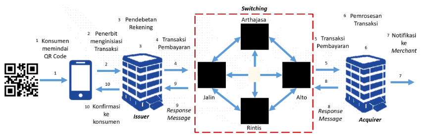

Perlu diketahui QR Code yang digunakan di Indonesia yang dinamakan dengan [QR Code](https://muhamadakmal.id/post/apa-itu-qris/) merujuk kepada sepsifikasi [QR EMVCo](https://www.emvco.com/emv-technologies/qrcodes/), EMVCo merupakan perusahaan gabungan dari Europay Mastercard dan Visa yang bertujuan untuk mendukung interopabilitas teknologi finansial secara worldwide.

Berdasarkan spek QR yang dirilis EMVCo QR Payment Acceptance terbagi atas 2, 

1. **Merchant Presented Mode** -> Merchant/pedagang menunjukkan QR, customer memindai QR code merchant

2. **Customer Presented Mode** -> Customer yang menujukkan QR, merchant/pedagang memindai QR code customer

Gambar diatas merupakan gambar teknis alur dari QRIS merchant presented mode.