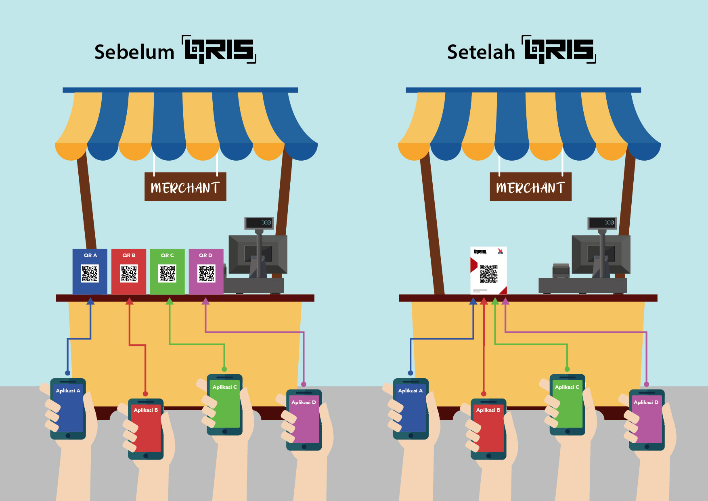

### Regulasi

QRIS, singkatan dari Quick Response Indonesia Code. tidak cukup indonesia untuk produk garapan regulator central keuangan di Indonesia, well tapi setidaknya dibacanya KRIS menurut penjelasan di situs [Bank Indonesia ](https://www.bi.go.id/id/sistem-pembayaran/QRIS/Contents/Default.aspx#). Singkatnya QRIS adalah QR Code (bukan barcode) yang berbentuk kotak yang dipakai untuk melakukan pembayaran. QRIS ini belum di implementasi sebelum Q2 2019 karena regulasinya pun belum ada merujuk ke *Peraturan Anggota Dewan Gubernur No.21/18/PADG/2019*, singkatnya PADG 2019 tentang QRIS, yang memang salah satu tujuan dibentuknya peraturan QRIS ini adalah untuk mendukung integrasi ekonomi secara nasional dan mendukung [inklusi](https://kbbi.kemdikbud.go.id/entri/inklusif) keuangan. Inklusi yang dimaksudkan disini adalah suatu kondisi dimana semua orang berusia kerja mampu mendapatkan akses yang efektif terhadap kredit, tabungan, sistem pembayaran dan asuransi dari seluruh penyedia layanan finansial. 

Sebelum adanya PADG 2019 tentang QRIS mungkin banyak dari kita yang sering menggunakan uang elektornik seperti gopay, OVO, dana dan yang lainnya untuk melakukan transaksi. Cukup kita lihat ada QR Code di pedagang (merchant) yang tertera brand uang elektronik tertentu, selama pengguna menggunakan uang elektronik tersebut pengguna dapat membayarkan merchant tersebut dengan saldo uang elektronik. 

Di awal 2019 penggunaan uang elektronik mulai masif, Bank Indoneisa mencatat transaksu melalui uang elektronik mencapai senilai lebih dari Rp56 triliun melalui berbagai platform, termasuk dompet digital. Dengan masifnya akuisisi merchant yang dilakukan oleh Penyelenggara Jasa Sistem Pembayaran melalui produk uang elektronik, hal ini berimbas dengan banyaknya QR code yang beredar di pedagang (merchant) offline, seperti foodcourt, supermarket, dan yang lainnya. Pada saat ini, saya pernah menemukan satu momen dimana satu pedagang kecil diakuisisi oleh 3 uang elektronik yang tentunya membuat saya sebagai pengguna bingung ingin menggunakan yang mana.

Di titik ini, analisa saya Bank Indonesia sebagai regulator melihat potensi inklusi keuangan, dan singkat cerita menerbitkan [PADG 2019 tentang QRIS](https://www.bi.go.id/id/peraturan/sistem-pembayaran/Pages/padg_211819.aspx)

#### Appendix

\- [File PADG-2019-QRIS](https://www.bi.go.id/id/peraturan/sistem-pembayaran/Documents/padg_211819.pdf)

\- [File TanyaJawab-PADG-2019-QRIS](https://www.bi.go.id/id/peraturan/sistem-pembayaran/Documents/faq_padg_211819.pdf)

*Referensi :*

*\- https://tirto.id/dompet-digital-semakin-banyak-pengguna-belum-tentu-diuntungkan-ejx2*

*\- https://www.finansialku.com/apa-itu-inklusif-keuangan-dan-literasi-keuangan/#InklusifKeuangan(Financial_Inclusive)*