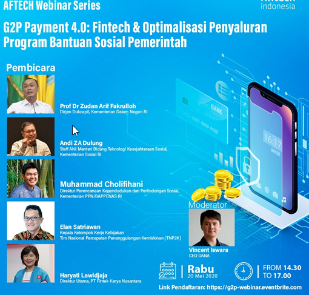

Beberapa waktu lalu, saya sempat mengikuti webinar yang di insiasi oleh [aftech](https://fintech.id/id). Webinar ini berisi tentang peran Fintech Payment sebagai optimalisasi penyaluran program bantuan sosial pemerintah.\
Acara ini dimoderatori oleh Vincent Iswara CEO [DANA](dana.id), sedangkan pembicara dalam acara ini

**\-** **Prof. Dr. Zudan Arif Fakrulloh** (Dirjen Dukcapil Kementerian Dalam Negeri RI)

**\- Andi ZA Dulung** (Staff Ahli Menteri Bidang Teknologi Kesejahteraan Sosial, Kementerian Sosial RI)

**\- Muhammad Cholifihani** (Direktur Perencanaan Kependudukan dan Perlindungan Sosial, Kementerian PPN/BAPPENAS RI)

**\- Elan Satriawan** (Kepala Kelompok Kerja Kebijakan Tim Nasional Percepatan Penanggulangan Kemiskinan - TNP2K) 

**\- Haryati Lawidjaja** (Direktur Utama, PT Fintek Karya Nusantara)

**Berikut merupakan slide yang dishare dari dalam webinar;**

[Kemensos_Andi Z.A Dulung - PROGRAM BANTUAN SOSIAL PEMERINTAH_SEBELUM DAN SESUDAH COVID-19](https://drive.google.com/file/d/1IBCDZvt8LHOxHzzLOQWfimf9rJ1RnP6y/view?usp=sharing)

[TNP2K_Elan Satriawan - Pemanfaatan FINTECH Untuk LPG, Listrik & Bansos_AFTECHWebinar_May2020](https://drive.google.com/file/d/1-wY0yN9Z5KVuNBP-QC9l0MECT5jhu35Y/view?usp=sharing)

[LinkAja_Haryati Lawidjaja - Digitalisasi Bantuan Pemerintah Kepada Masyarakat \[G2P]](https://drive.google.com/file/d/1dvscN5FeRi_BcKygFYGpxnVz_URq1Ycd/view?usp=sharing)

[Kementerian PPN-Bappenas_Muhammad Cholifihani - Arsitektur dan Perkembangannya_studi Bappenas, World Bank, dan Microsaves](https://drive.google.com/file/d/1OFs6zePH2B-RV8Dn8hqh3ftYmz4g4hnE/view?usp=sharing)