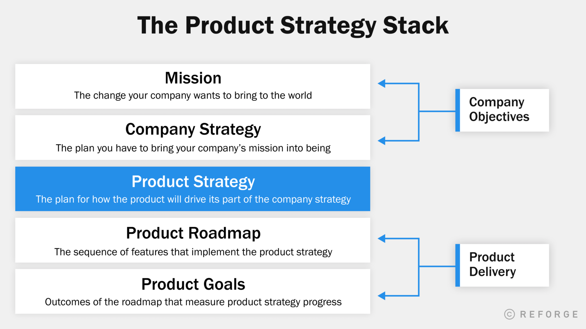
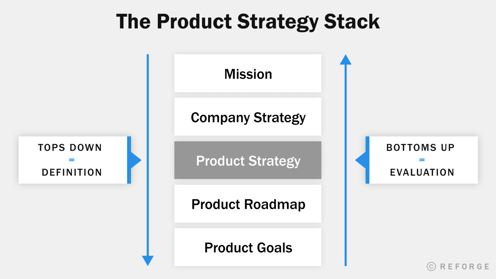
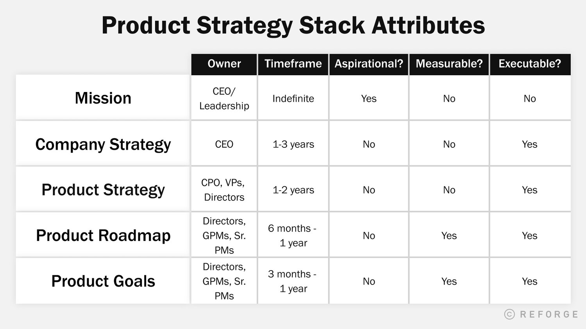
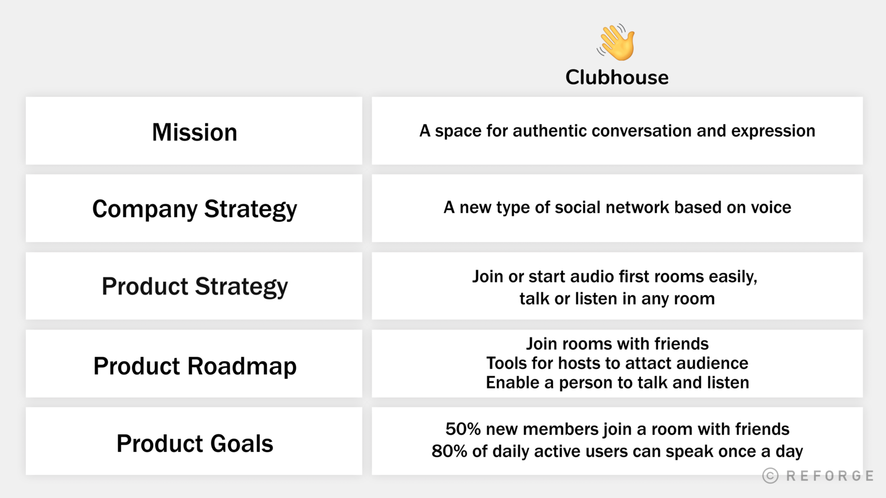
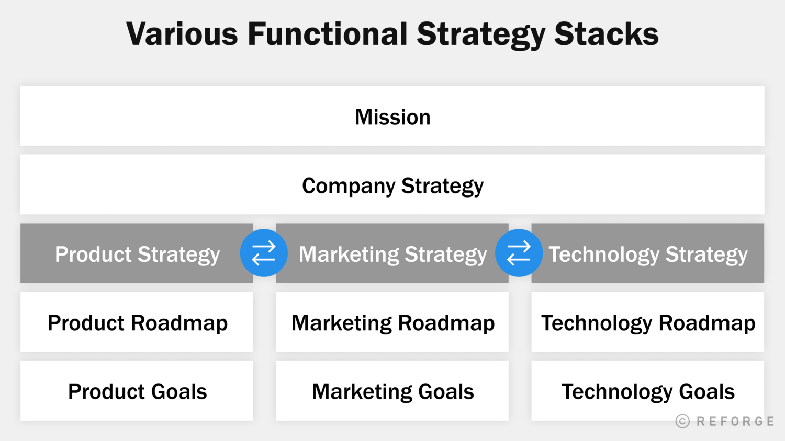

Kata-kata strategy terkadang sering disalah artikan dan seringkali di lebarkan kepada yang bukan mana artinya. Strategy kerap kali di artika "Visi", "Misi", "Gaols", dan "Roadmap" dijadikan satu yang meninggalkan sebuah arti yang tidak memiliki konteks sama sekali. Dan kerap kali product team menemukan ini merupakan ketidak jelasan untuk membuat sebuah perusahaan maju kedepan.

Sebagai contoh kadang kita kerap mempertanyaka:

* Apakah saya harus memprioritaskan fitur baru atau mengoptimisasikan flow fitur eksisting?
* Apakah saya harus menutup kemungkinan baru, atau memperpanjang kemungkinan yang sudah ada?
* Apakah saya harus membuat fitur ini in-house, atau menggunakan third-party services?

Dalam menjawab pertanyaan diatas, product leader kerap kali berpikir "Membuat prioritas dari suatu fitur itu sulit", "Pengorbanan ini tidak mungkin dilakukan", "Saya tidak merasa yakin dengan penentuan prioritas ini". Dalam banyak kasus, kesulitan mempriotiaskan low-level execution ini disebabkan oleh high-level problem.

> Kesulitan dalam memprioritaskan seringkali merupakan masalah strategim bukan masalah eksekusi.

Kesenjangan dalam strategi mempersulit tim untuk mengeksekusi. Ini mengakibatkan hilangnya peluang. Eksekusi menjadi jauh leih mudah ketika strategi didefinisikan dengan jelasm dikomunikasikan, dan terhubung dengan misi perusahaan dan pekerjaannya sehari-hari.

## Apa itu Product Strategy Stack

Dalam penentuan product startegy stack, perusahaan harus memikirkan hubungan antara misi, strategi, roadmap, dan tujuan sebagai setumpuk konsep yang berbeda:

* **Misi Perusahaan** - Target keseluruhan yang dilihat oleh perusahaan dan perubahan yang ingin dihadirkan kedalam target tersebut.
* **Strategi Perusahaan** - Rencana logis yang dimiliki untuk mewujudkan misi perusahaan
* **Strategi Product** - Rencana logis tentang bagaimana product akan mendorong bagiannya dari strategi perusahaan
* **Product Roadmap** - Urutan fitur yang menerapkan strategi product
* **Product Goals** - Hasil dari quarter dan daily dari product roadmap yang mengukur seberapa maju kemajuan terhadap strategi product

## Product Strategy adalah Jaringan Penghubung

Setiap lapisan merupakan prasyarat untuk lapisan berikutnya. Kita tidak dapat memiliki strategi perusahaan tanpa mengetuahu misi perusahaan kita, Kita tidak dapat memiliki tujuan produk tanpa mengetahui strategy product kita. Mengnigat hubungan antara lapisan ini, strategy dari sebuha product memiliki peran penting -- ini adalah jaringan penghubung antara tujuan perusahaan dan pekerjaan inti dari tim product dalam men-deliver sebuah product.

## Top Down = Definition, Botom Up = Evaluation

Product Strategy Stack adalah sistem yang dapat kita gunakan untuk perencanaan dan pelaksanaan:

* **Top-Down**

  Tim dapat bekerja dari atas tumpukan ke 1) menentukan tumpukan, 2) bekerja pada tingkat yang semakin halus untuk merencanakan eksekusi produk, dan 3) menyelaraskan perusahaan dengan rencana eksekusi tersebut.
* **Bottom-up**

  Selain itu, tim dapat bekerja dari bawah hingga 1) mengkomunikasikan status pelaksanaan dan 2) melacak seberapa baik kerja tim produk dalam mendorong tujuan tingkat perusahaan.

## The Product Strategy Stack in Depth

## What Bad Product Strategy Stack Feels Like

#### KESULITAN DALAM MEMPRIORITASKAN

Gejala paling umum dari tumpukan strategi yang buruk adalah kesulitan memprioritaskan. Misalnya, tim mungkin kesulitan untuk mengevaluasi trade-off antara mengoptimalkan aliran untuk pengguna baru vs. memenuhi kebutuhan pengguna yang kuat.

#### MISKOMUNIKASI DALAM TIM

Kesulitan dalam membuat prioritas sering kali menyebabkan putusnya komunikasi dalam tim. Beberapa rekan tim ingin pergi ke satu arah, dan yang lainnya tidak akan setuju. Tanpa konteks yang tepat, orang akan mengandalkan pendapat masing-masing, daripada menyelaraskan dengan tujuan bersama.

#### UX PROSES YANG AMBURADUL

Kurangnya prioritas yang jelas dapat mempengaruhi pengalaman pengguna. Strategi yang jelas mengarah ke UX sederhana. Ketika strateginya tidak jelas, tim mungkin membuat pilihan yang tidak konsisten atau dikompromikan. Seiring waktu, hal ini dapat berdampak buruk. Sejarah teknologi dipenuhi dengan produk-produk yang membengkak yang diganggu oleh para pemula yang lebih beropini dan efisien.

#### KURANGNYA KOORDINASI ANTAR TIM

Tanpa strategi menyeluruh yang jelas untuk mengarahkan peta jalan, tim di seluruh perusahaan dapat dengan mudah menjadi tidak sejajar dan memprioritaskan hal-hal yang berbeda. Ini terutama benar ketika tim memprioritaskan hasil berbeda yang masuk akal secara lokal untuk kelompok mereka tetapi tidak memajukan perusahaan. Misalnya, tim penjualan perusahaan dapat menerapkan fitur rumit untuk satu pelanggan, sedangkan tim produk inti difokuskan pada penyederhanaan produk untuk mendukung UKM dengan lebih baik.

#### **SATURASI PRODUCT MARKET-FIT** 

Akhirnya, perusahaan mencapai batas kesesuaian produk-pasar mereka ketika strategi didefinisikan dengan buruk atau tidak lengkap. Tim tidak dapat berimprovisasi dengan cara mereka ke [sumber baru yang sesuai dengan pasar produk](https://oku6bnmn6udxml2sr2qkiwbquq--www-reforge-com.translate.goog/blog/product-work-beyond-product-market-fit) . Sebaliknya, [pemimpin produk](https://oku6bnmn6udxml2sr2qkiwbquq--www-reforge-com.translate.goog/product-leadership) perlu mengantisipasi kejenuhan dan secara proaktif memperluas kesesuaian pasar produk mereka untuk menjangkau audiens baru dan / atau nilai baru.

#### DAMPAK NEGATIF TERHADAP MORAL

Seiring waktu, strategi yang didefinisikan dengan buruk sangat membebani tim yang kuat. Ketidakjelasan membuat kerja tim menjadi beban. Mereka mungkin kehilangan kebanggaan dalam mengirimkan produk yang terasa tidak fokus, atau merasa kalah ketika keuntungan yang semakin berkurang. Mereka mungkin merasa bahwa mereka tidak mendapatkan konteks dan sumber daya yang mereka butuhkan dari kepemimpinan. Pada akhirnya, orang yang berkinerja tinggi akan berhenti bekerja jika mereka tidak percaya atau tidak dapat memahami strateginya.

## Type of Product Strategy Stacks

](great-vs-good-vs-bad-product-strategy.png "## Type of Product Strategy Stacks  ")

## Clubhouse Stacks Example

## Stacks on Stacks

Product Startegy Stack hanyalah permulaan. Setiap fungsi dalam perusahaan harus diselaraskan agar perusahaan mencapai potensi penuhnya. Teknologi, [pemasaran](https://oku6bnmn6udxml2sr2qkiwbquq--www-reforge-com.translate.goog/marketing-strategy) , operasi, dan fungsi lainnya perlu menentukan strategi fungsional, peta jalan, dan tujuan untuk menaiki strategi perusahaan dan membantu perusahaan mencapai misinya. Kita dapat melihat tingkat keselarasan ini di perusahaan yang sukses seperti Apple, di mana setiap elemen bisnis memperkuat strategi dan misi tunggal. Mencapai tingkat penyelarasan ini tidaklah mudah, tetapi tumpukan strategi dapat membantu.

Sumber  [The Product Strategy Stack — Reforge](https://www.reforge.com/blog/the-product-strategy-stack)